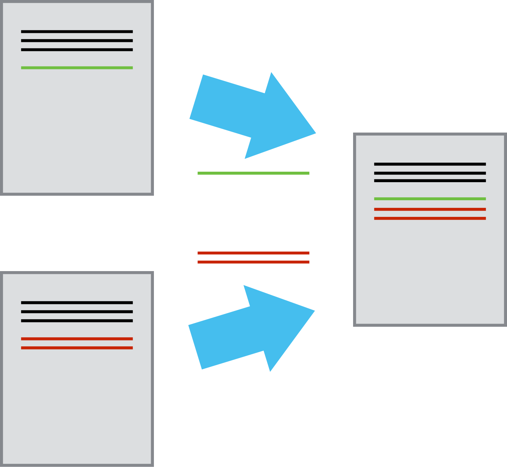

Version Control via Git and Github
========================================================
date: June 2, 2015

What is Version Control?
========================================================
 
 

Version control is a system that records changes to a file or set of files over time so that you can recall specific versions later.

(includes git, cvs, svn, mercurial)

=======================================================

 
 
## How do you record the history of your projects?

Bad
========================================================

***

(http://www.phdcomics.com)

Good
========================================================

    2013-10-14_manuscriptFish.doc
    2013-10-30_manuscriptFish.doc
    2013-11-05_manusctiptFish_intitialRyanEdits.doc
    2013-11-10_manuscriptFish.doc
    2013-11-11_manuscriptFish.doc
    2013-11-15_manuscriptFish.doc
    2013-11-30_manuscriptFish.doc
    2013-12-01_manuscriptFish.doc
    2013-12-02_manuscriptFish_PNASsubmitted.doc
    2014-01-03_manuscriptFish_PLOSsubmitted.doc
    2014-02-15_manuscriptFish_PLOSrevision.doc
    2014-03-14_manuscriptFish_PLOSpublished.doc

Better - Saving everything together at once
======================================================
 
 

Everytime you make a save, you zip the entire directory that your project files are in and save it with a date.

Best - Version Control
======================================================

[https://github.com/ropensci/RNeXML](https://github.com/ropensci/RNeXML)

Code for RNeXML R package, plus RNeXML publication in RMarkdown

========================================================

 
Version control systems start with a base version of the document and then save just
the changes you made at each step of the way.

You can think of it as a tape: if you
rewind the tape and start at the base document, then you can play back each change
and end up with your latest version.

<small>via Software carpentry</small>

=====================================================
You can then think
about "playing back" different sets of changes onto the base document and getting
different versions of the document.

Why use Git?
========================================================
 
- Makes you fearless
- Easy to set up
- Allows you to take a snapshot of every stage of your project history
- Takes up minimal space
- Creates a easy navigatable map to the history of all changes made

Features of using a Hosting Service Like Github
=======================================================
 
*   Backup of your project
*   No need for a server: easy to set up
*   GitHub's strong community: your colleagues are probably already there
*   Provides tools to help enhance collaboration
*   A common location to share off your work

Example
========================================================

[https://github.com/ropensci/RNeXML](https://github.com/ropensci/RNeXML)

Exercise: git via GitHub
=======================================================
 
- create a git repository hosted at GitHub
- record changes to files in the repository
- history, diffs, and blame
- two ways to collaborate on GitHub (aka 'Who are your collaborators?')
- GitHub features: Issues and wikis
