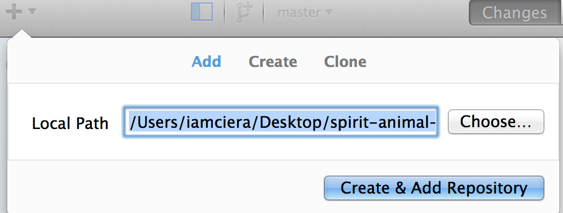
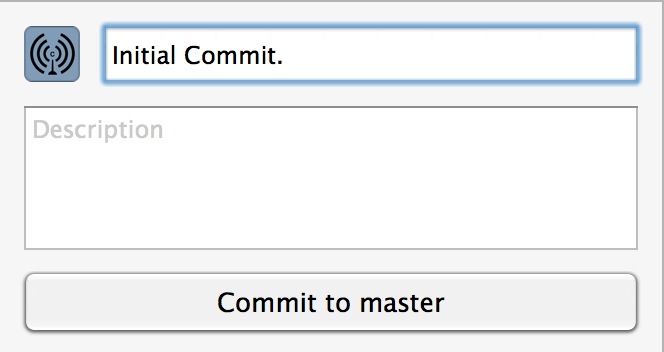
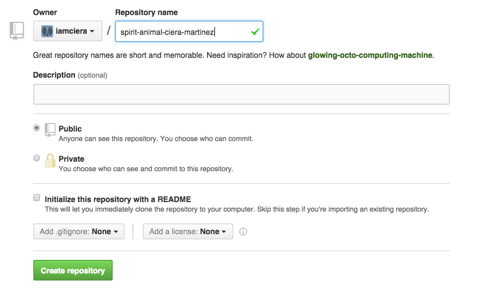
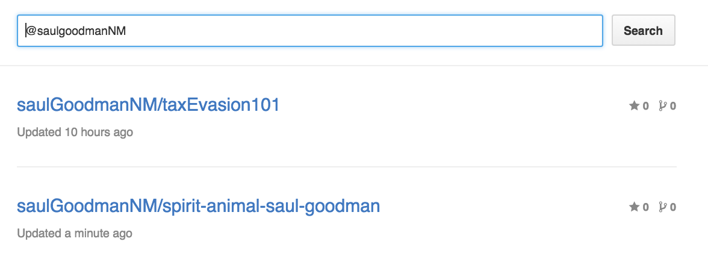
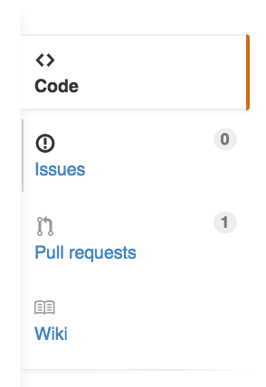

# Version Control via Git and Github
*No command line skills needed.*

**Before this lesson**:

*  Obtain a Github account. If you sign up using a student email you get five free private repositories through the [student developer pack](https://education.github.com/pack).
* Install Github GUI. [Github GUI Guide (Mac)](https://mac.github.com), [Github GUI Guide (Windows)](https://windows.github.com).  

**After this lesson, you should be able to**:

*   Initiate Git in a local project directory.
*   Evaluate Repository History.
*   Know the difference between directory and repository.
*   Commit changes to files.
*   Push local repository to remote repository on Github.
*   Clone a remote repository.
*   Create a pull request to someone else's remote repository.
*   Differentiate between local and remote Repositories are.  

## I. Git Locally 

**Goal**: To initiate and make commit on a local directory (folder on your computer).

**Tip**: With Git comes many strong opinions on the best practices of how to use Git. The truth is Git can be really straight forward to use and best practices only make sense and develop once you start using it. This tutorial will strive to show you Git as simply as possible, while guiding to learn more about best practices. So let's start using it!

### I. Part 1: Initiate Git in a Directory (`git init`)

Find your `lit-prog` directory, which may already be on your computer from the organization lesson. If not, download here. Open the GitHub GUI.  Click the `+` in the top left corner of the screen, choose `add`, and either enter the path to the `lit-prog` or click `choose` to find the folder on your computer.  To complete click `create and add repository`.

Now you have initiated Git into that directory you have created a `Git repository`, which is a directory that is now being tracked by Git software. It is tracked through a hidden file called `.git` within the directory you added. It does not matter where you move the directory, as long as the .git file remains within, you will have your Git history of that project.

### I. Part 2: Commit (`git commit`)

At this point we have just initiated Git within the `lit-prog` directory.  You can see in the "History" tab that this repository has no history.  History only begins by making a **commit**.  Git is all about composing and saving snapshots of your project and then working with and comparing those snapshots. A commit is taking a snapshot, while attaching a little note to help you navigate to why that instance of the project is important.  

Let's go ahead and make a commit. All you have to do is add a message that describes your commit and press "Commit to master". 

Now if you see that "Changes" tab is blank and if you look at "History", you can view your first commit. 

*tip*: There are many beliefs on best practices of committing.  The best advice is: Commit early and often. Then strive to describe your commit concisely, but with meaning. You want to be able to understand exactly what point of the project you are in months from now. 

### I. Part 3: Changing files (`git diff`)

Open up the `countryPick4.Rmd` and add your name to the YMAL front matter at the top of the document, then Save.

    ---
    title: "Pick four - comparing trends in population  over time"
    output: pdf_document
    Author: Ciera Martinez
    ---

Now if you look at the "Changes" tab you can see that the line I added is clearly displayed in green.  You may also notice that there are no other files present since we did not change anything else. 

Go ahead and commit this change.

### **On your own**: 

Update the `countryPick4.Rmd` with the date and commit this change.

    ---
    title: "Pick four - comparing trends in population  over time"
    output: pdf_document
    Author: Ciera Martinez
    Date: June 2, 2015
    ---

Add your name to the top of the `README.md` file content and commit this change.

    #Files for the Literate Programming lesson
    *Modified by Ciera Martinez*

### I. Part 4: "Rolling Back" into the past (`git reset`)

Now that you have a small history, let's go back in time. **"Rolling back" (`git reset`)** creates a new commit that reverts the changes of the commit you choose.  

You can rollback to a single commit by clicking on the commit you would like to go back to and selecting “Rollback to this commit”. 

Try rolling back to your first commit and viewing your `countryPick4.Rmd` file.  You can see that that file is now in the state when you made your first commit. 

Rolling back will leave the original commit in the repository's history, so you can always revert a revert if necessary and never lose any commits.  Do this on your "Added Date Line" commit to get back to where we were by "Rolling back" to the commit where you added your name to `README.md`.

**Tip:** If you are going to use the Github GUI, only use the Rollback option, don't use revert. Things can get really confusing fast. I highly recommend messing around with it further on a folder you are not concerned with or begin using command line git to have more control.  Also, there is an "undo" option in the "changes" tab if your git history gets confusing, but there is a general rule to never rewrite your git history *especially* if you are collaborating or have already published/hosted your code on-line. 

**Questions**:

*   What is the difference between directory and repository?
*   What happens if you move your directory?  Do you still have your git history?
*   What is the rollback mean?

## II. Git Remotely: Hosting on Github (`git push`)

### II. Part 1: Log in to Github in your browser, then click on the icon in the top right corner to create a new repository and 

name it `lit-prog-firstName-lastName`. For example, `lit-prog-ciera-martinez`. Then click "Create Repository".

As soon as the repository is created,
GitHub displays a page with a URL and some information on how to configure your local repository:

Copy the HTTPS text line: example `https://github.com/iamciera/lit-prog-your-martinez.git`

**II. Part 2**: Connect the two repositories, your local repository and the newly created remote repository on Github. First, login to your Github account in the Github GUI from File > Preferences > Accounts. 

Now we need to make our GitHub repository a remote for the local repository. Go back to the GitHub GUI and click "Publish" in the top right hand corner. 

The home page of the repository on GitHub includes the string we need to identify it.  Go to Repository > Repository Settings, click "remote" and paste in the HTTPS address.  And click "Publish" in the top right corner. 

If you go back to your browser and press refresh, all your files should be there on Github!  

## II. Part 3: Cloning Others Repos (`git clone`) and Collaborating 

One of the most powerful aspects of using git is for multiple people to work on a single project together. Many of you may be aware of the struggles of emailing many drafts of a single document to people on your team. By the time you get back edits from one person, the document from the other is already outdated. While these types of problems can be overcome using a service like Google Drive, on a project with multiple files, organization becomes confusing fast. 

*tip*: Best practices for collaborating through Git vary widely.  If you want to start contributing to a Git repository, often times you can find rules for in a file called `CONTRIBUTING.md`.  

A brief outline of how many people collaborate on Github:

1.  Get a copy of a project by `fork`ing the original repository to your remote server. 
2.  `clone` your forked repository locally. 
3.  Make any changes. Commit changes.
4.  "Publish" / `push`changes to your remote server.
5.  Ask to merge your changes to the original project by creating a pull request.
6.  Owner of the original repository checks your changes and merges your changes into the repository by accepting the pull request.

### II. Part 4: Forking a repository

For this exercise, team up with one other person. You will be making changes to their newly created `lit-prog-your-name` repository and they will be making changes to yours. First find your partners repository by searching for their @name in the search bar at the top left of your Github home page. Click on their `lit-prog` repository.

Once there click the "fork" button on the top left of the screen.

Once you have your own copy, copy the 

Now you should have your own version of your partners repository to do whatever you want with it!  You can do this with anyone's public project. This is how easy knowledge is spread and built upon is spread.   You can even fork your own version of [ggplot2](https://github.com/hadley/ggplot2), the entire program, you can go back into the history of every hosted project and see how it was built. Github even has a lot of cool tools to visualize the history.  For example check out the history of how yesterday's [Organization lesson](https://github.com/Reproducible-Science-Curriculum/rr-organization1/network).  So now that we have our own copy, let's contribute to your partners project project.

### II. Part 2: Cloning a Repository (`git clone`)

While forking is coping someone's repository to your remote server, cloning is putting all the files in the repository directly onto your local computer.  You can directly clone someone's repository without forking, but it is best practice to fork first. 

So let's clone the recently forked repository. Make sure that you are cloning the forked copy.  Check and make sure that your name should be in the top left hand corner of the repository page. Cloning is easily accomplished by clicking the "Clone in Desktop" button on the right side bar on the repository page. 

Now choose a location to put the repository on your computer and click "clone".  Depending on the size of the repository, this can take some time, but these small repositories should clone fast. 

### III. Part 3: Making Changes

Now that we have the copy, let's add something to the file. Add your name to the top of the 'README.md' file along with the one sentence about your research. Example: 

    #Files for the Literate Programming lesson
    *Modified by Your Name*

    *Also Modified by Ciera Martinez: I research the evolution and development of plant shape.

Commit this change and "Publish" / push back to *your* remote repository.

### II. Part 4: Creating a Pull Request

The last step on your end is sending your changes to the original owner of the repository by creating a pull request.  Go to the repository page you just pushed to and click the green button with two arrows near the name of the repository, then proceed by clicking "create pull request".

### II. Part 5: Accepting a Pull Request

All that is left is accepting the pull request that has been sent to you requesting changes to your original repository. Go to your original repository, if everything went well on your partner's side, on the left side bar you can see that you have one pull request, click on the tab. You can see what your partner wants to add and if it looks good, "merge pull request".  You can add a commit to discuss the changes here also. 

It may take a few times to get used to all the changes, so I highly encourage you to keep practicing. Find and create projects that allow a non-judgmental way to practice. Here are a few repositories that encourage practicing:

-   [https://github.com/TheCodingCollective/quotes](https://github.com/grayghostvisuals/Practice-Git): Run by Ciera.
-  [https://github.com/grayghostvisuals/Practice-Git](https://github.com/grayghostvisuals/Practice-Git)
-   [https://bitbucket.org/tutorials/tutorials.bitbucket.org](https://github.com/grayghostvisuals/Practice-Git)

### More information:

**Branching**:  Dev. branch, 

**How to Contribute**CONTRIBUTING.md, 

Workflows, 

**Conflicts**[Conflicts](http://swcarpentry.github.io/git-novice/09-conflict.html), ect.)

## A note about Git command line

The Github GUI is nice, but I highly recommend using Git on command line. 

*   If you are unfamiliar with Unix, using command line Git is a great project to get more familiar with more Unix and Git. 
*   Most people are using command line git, so getting help with problems is ALOT easier. 
*   There are features in command line that are not available in the GUI. 
*   Git is a marketable skill, if you choose to pursue any job in industry, they will expect you to know command line Git. 
*   If you started with using the GUI and want to start using command line, no problem, your git history will not change.  

## Resources

-   [Github GUI Guide (Mac)](https://mac.github.com/help.html)
-   [Github GUI Guide (Windows)](https://windows.github.com/help.html)
-   [Bitbucket](https://bitbucket.org/) - alternative to Github hosting. Unlimited free 
 
### Examples of code from research papers on Github

-   [https://github.com/tessington/PNASForageFish](https://github.com/tessington/PNASForageFish)
-   [https://github.com/seananderson/paleobaselines/](https://github.com/seananderson/paleobaselines/)

### Best Practices

-   [Nice Overview of Best Practices](https://sethrobertson.github.io/GitBestPractices/)
-   [Git Flow CheatSheet](http://danielkummer.github.io/git-flow-cheatsheet/)

## Attribution and Licenses

This material was influenced and remixed from 

- [Software Carpentry Git Novice Lesson](http://swcarpentry.github.io/git-novice/) - Copyright © Software Carpentry. All Software Carpentry instructional material is made available under the [Creative Commons Attribution license](https://creativecommons.org/licenses/by/4.0/). The following is a human-readable summary of (and not a substitute for) the full legal text of the [CC BY 4.0 license](https://creativecommons.org/licenses/by/4.0/legalcode).
- [Jenny Bryon's Test Drive R Markdown Lesson](http://stat545-ubc.github.io/block007_first-use-rmarkdown.html)

